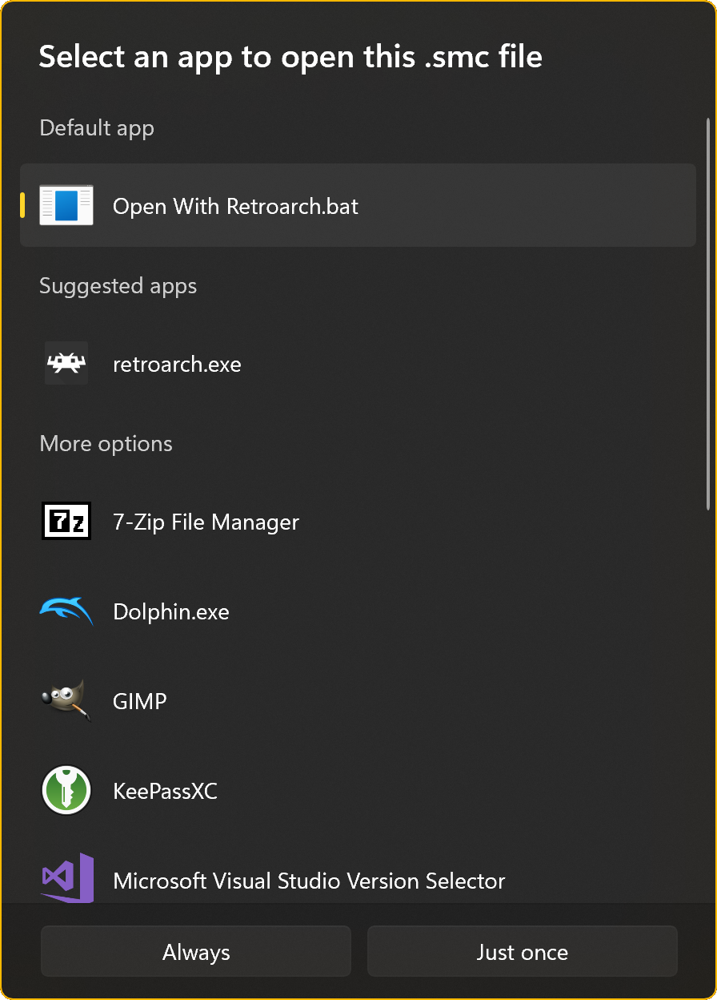

## About the script
A simple windows script that allows to open Roms with Retroarch within the Explorer.  
Development started in November 2022.

## Installation
1. Download the script
2. Save it somewhere safe
3. Open a ROM and select the script as the default program
4. Enjoy

## Compatibility
Tested on Windows 11 with Retroarch 1.13.0 from Steam.

## Screenshots

