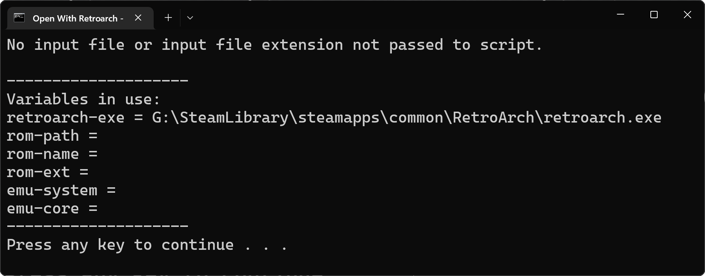

## About the script
A simple windows script that allows to open Roms with [RetroArch](https://github.com/libretro/RetroArch) within the Windows File Explorer.  
Development started in November 2022.

## Installation
1. Download the script
2. Save it somewhere safe
3. Verify that the script can find the RetroArch executable - if not, change the path in the script
4. Open a ROM and select the script as the default program
5. Enjoy

## Keys
Here is a list of keys that can be used if you want to add the script to your itch library: [List of keys](Itch-Keys.txt)

## Compatibility
Tested on Windows 11 with RetroArch 1.13.0 from Steam.

## Screenshots

### Opening a ROM

Here we can see the script in the "Open With" menu.

### Example of an error

In this case, we didn't select a ROM. Instead, we only started the script.
